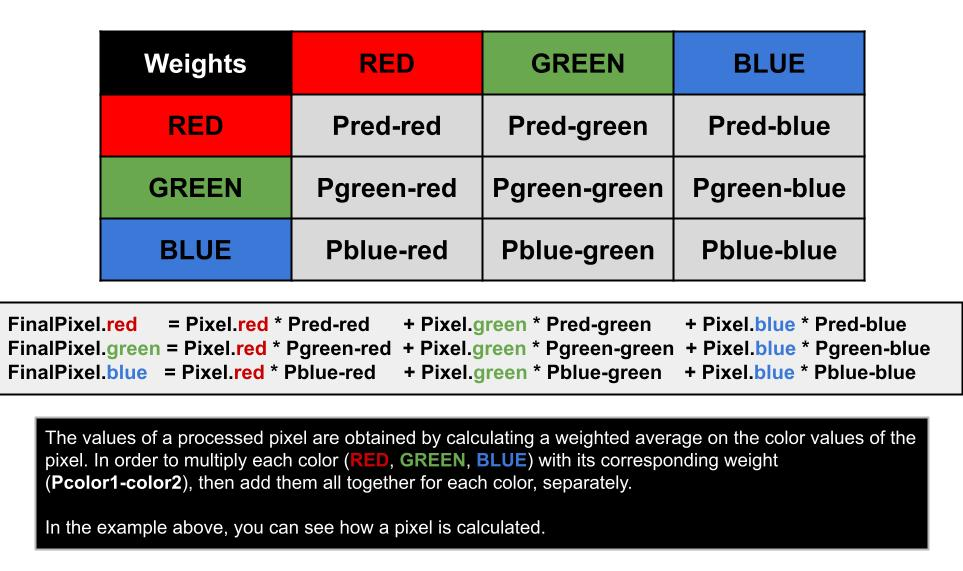

# Photo Editing App

## Welcome! 👋

### This time, your challenge is to implement a photo editing application which allows a user to apply a selection of different filters on a chosen image.

You can learn more about how this can be done you can check out [Wikipedia - Kernel(Image Processing)](https://en.wikipedia.org/wiki/Kernel_(image_processing)).

### Expected behaviour
A user should be able to:

 - Select a picture in the local file system using the input of type file
 - Preview it in the "Before" and "After" sections
 - Select a filter from the filter selection menu
 - Apply the chosen filter and see the resulting image in the "After" section

For testing, you can use the test selection menu and click "Run test". This will show the result of each test in the console. You may have to wait a bit since there will be quite a lot of information to process.

### Where to find everything

The application consists of 3 files:
 - [a HTML file: photo-editor.html](./photo-editor.html) - containing a minimal working interface
 - [a CSS file: photo-editor.css](./photo-editor.css) - containing some definitions to make sure the images are shown at the correct aspect ratio
 - [a JS file: photo-editor.js](./photo-editor.js) - containing the starter code. This file contains quite a few data structures and methods you can use.
 ** Be sure to go over these helper functions thoroughly and follow the documentation and instructions **
 
In addition to the code, there are also some testing resources in the [testImages folder](./testImages). **Do not modify these files, so the tests run as expected**. You can use any image file you have on your computer, but keep in mind that larger resolution pictures will take more time to be processed.

## What do you have to do
Your main task is to complete the functions in the [photo-editor.js file](./photo-editor.js). It is recommended to use the starter code, although you can start from scratch. You can also modify the HTML and CSS files to create a more pleasant user-experience.

Before looking at the tasks, let's introduce the data structures

### Data structures
For a more intuitive approach, we structure the information in an image as a matrix of pixels.
  - Pixel class:      contains the red, green, blue and alpha (opacity) values. All these values should be between 0 and 255.
  - PixelData class:  contains the height and width of the image, together with the values of each pixel in a matrix (array of arrays of pixels)
Each class has a few methods you can use. These are documented in the code, so be sure to read the descriptions carefully.

### Tasks
**! All the tasks are detailed in the code as well. You can search for "todo" or "TODO" in the code to find them. !**

#### 1) Implement the PixelData.getNeighbours method
  This method should retrieve a pixel and its neighbours from the picture, as shown below at **point 2**. In this picture, the processed pixel is the GREEN one. There are cases when the pixel will be on an edge or a corner, so we will need to pad the image with empty pixels.
  
#### 2) Implement the Pixel.fromKernelFilter method
  This method calculates the value of a pixel in the processed image, by calculating a weighted average of the RGB values of the pixel and its neighbours. This weighted average is computed for each color (We consider all alpha values 255, so we do not need to worry about them).
  This method will be used for all filters **apart from GRAYSCALE and SEPIA**.
  

#### 3) Implement the Pixel.fromColorFilter method
  This method calculates the final RGB values of the pixels as a weighted average of the initial RGB values. Each final color is a combination of the initial values of each color, as depicted below.
  This method will be used for **only for GRAYSCALE and SEPIA**.

#### 4) Implement the PixelData.applyFilter method
  This method combines the previous methods in order to produced the processed image. You will need to create a new data object, and iterate over each pixel in order to get its final value. Be careful to use **fromColorFilter** for the GRAYSCALE and SEPIA filter, and **getNeighbours** and **fromKernelFilter** for the rest.
  You can use the **PixelData.addPixel(pixel)** method to build the final image.
  
### Testing
  At any point of your development, you can use the built-in tests to check your progress. You can either call them in the console (Ex: **testStep1()**), or use the test selection menu at the bottom of the page and clicking run test.
  Each test will log its output **in the console**, together with the value which did not match the expected result.
  **! The filter applying tests can take some time, so be sure to wait for the output of the test. !**

And at last...
**Have fun building!** 🚀
